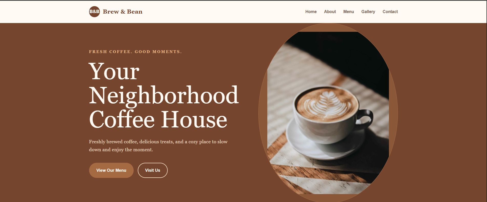

# Coffee Shop Website

## Overview

Brew & Bean Coffee House is a single-page website for a fictional neighbourhood café.

## Purpose

Lets local customers see the menu, learn about the café and find contact details.

## Features

- Hero with 'View Our Menu' and 'Visit Us' calls to action
- About section ('Made With Passion')
- Menu cards for Espresso, Cappuccino, Latte, Iced Coffee, Chocolate Cake and Croissant with prices ($3.25-$5.00)
- 'Why Choose Us' highlights
- Photo gallery section
- Contact form and business contact details

## Technologies

HTML, CSS. No frameworks or build step; the project is one self-contained `index.html`.

## Responsive Design

Layout adapts with CSS media queries. Tested without horizontal scrolling at 360, 390, 768, 1024 and 1440px widths.

## UI/UX

Warm coffee tones, large food photography and short, scannable sections suited to a small business.

## Known Limitations

Contact form is front-end only. Email (`.example` domain) and phone are placeholders. There is no separate location map.

## Project Structure

```text
02-coffee-shop-website/
├── index.html
├── screenshots/
└── README.md
```

## Screenshots
 


## Live Demo

[Live Demo](https://github.com/d-sandeepani/frontend-web-projects/coffee-shop-website)


## Learning Outcomes

Card layouts, image galleries with CSS, small-business site structure.
