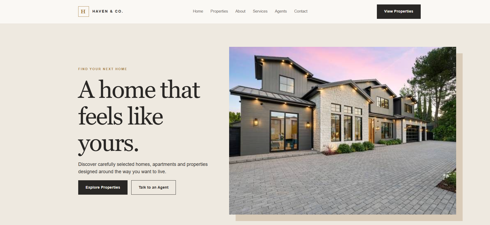

# Real Estate Landing Page

## Overview

Haven & Co. is a landing page for a fictional real-estate agency.

## Purpose

Lets property seekers browse featured homes and contact an agent.

## Features

- Six featured property cards (e.g. Modern Hillside Villa, Downtown Luxury Apartment) with prices from $620,000 to $1,450,000
- Search bar (location, property type, price range)
- Explore-by-type cards (houses, villas, apartments, family homes)
- Four-step buying journey and agent profile
- Testimonials, FAQ and inquiry form

## Technologies

HTML, CSS. No frameworks or build step; the project is one self-contained `index.html`.

## Responsive Design

Layout adapts with CSS media queries. Tested without horizontal scrolling at 360, 390, 768, 1024 and 1440px widths.

## UI/UX

Neutral, upmarket palette with large property photography and bordered buttons.

## Known Limitations

The search bar is **UI only**: submitting it does not filter the listings. Inquiry form is front-end only. Phone navigation shows only the 'View Properties' button.

## Project Structure

```text
06-real-estate-landing-page/
├── index.html
├── screenshots/
└── README.md
```

## Screenshots
  

## Live Demo

[Live Demo](https://d-sandeepani.github.io/frontend-web-projects/real-estate-landing-page/)


## Learning Outcomes

Property-card layouts, select-based search UI, trust-building sections.
