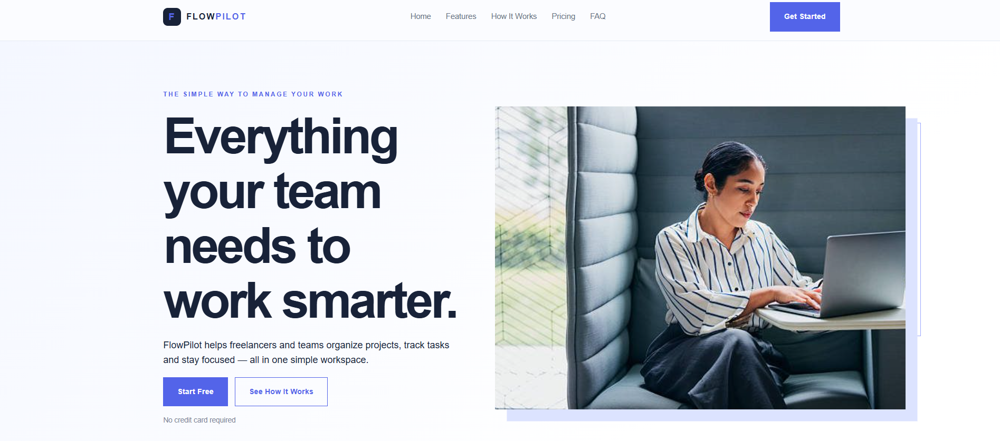

# SaaS Landing Page

## Overview

FlowPilot is a landing page for a fictional workflow/project-management app.

## Purpose

Explains the product's value and drives visitors to sign up.

## Features

- Feature cards: Project Management, Task Tracking, Team Collaboration, Progress Tracking, Smart Organization, Simple Dashboard
- Three-step 'how it works'
- Pricing: Starter $0, Professional $19, Business $49
- Five-question FAQ and several 'Get Started' CTAs
- Contact form

## Technologies

HTML, CSS. No frameworks or build step; the project is one self-contained `index.html`.

## Responsive Design

Layout adapts with CSS media queries. Tested without horizontal scrolling at 360, 390, 768, 1024 and 1440px widths.

## UI/UX

Clean product-marketing layout with repeated CTAs and a simple three-tier pricing comparison.

## Known Limitations

Sign-up buttons are links to on-page sections: there is no real sign-up or product. Form is front-end only. Phone navigation shows only 'Get Started'.

## Project Structure

```text
08-saas-landing-page/
├── index.html
├── screenshots/
└── README.md
```

## Screenshots

  


## Live Demo

[Live Demo](https://d-sandeepani.github.io/frontend-web-projects/saas-landing-page/)


## Learning Outcomes

SaaS marketing structure, pricing tiers, conversion-focused copy and layout.
