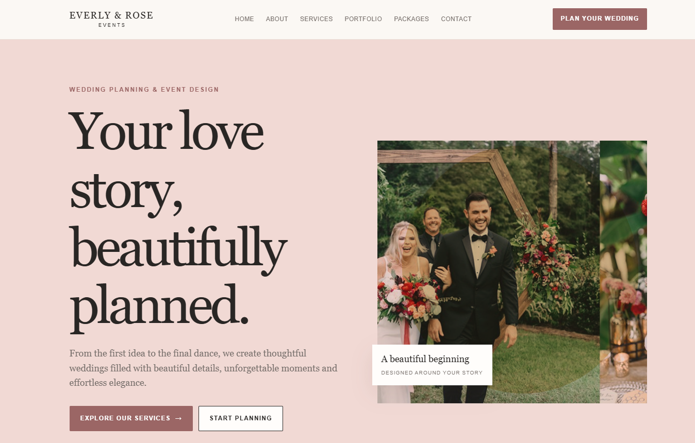

# Wedding Planner Website

## Overview

Everly & Rose Events is a business website for a fictional wedding and event planner.

## Purpose

Lets couples explore services and packages, then send an inquiry.

## Features

- Five services: Full Planning, Partial Planning, Day-of Coordination, Event Styling, Destination Weddings
- Portfolio of past events (image gallery)
- Packages: Essential $1,500, Signature $3,500, Luxury $6,000
- Four-step planning process
- Testimonials and four-question FAQ (`<details>`)
- Inquiry form with names, email, date, location and guest count

## Technologies

HTML, CSS. No frameworks or build step; the project is one self-contained `index.html`.

## Responsive Design

Layout adapts with CSS media queries. Tested without horizontal scrolling at 360, 390, 768, 1024 and 1440px widths.

## UI/UX

Soft, romantic styling with generous spacing; the inquiry form asks wedding-specific questions rather than a generic message box.

## Known Limitations

Inquiry form is front-end only and does not send data. Contact details are placeholders.

## Project Structure

```text
04-wedding-planner-website/
├── index.html
├── screenshots/
└── README.md
```

## Screenshots
 


## Live Demo

[Live Demo](https://d-sandeepani.github.io/frontend-web-projects/wedding-planner-website/)


## Learning Outcomes

Multi-field forms (date, number, text), package comparison layout.
