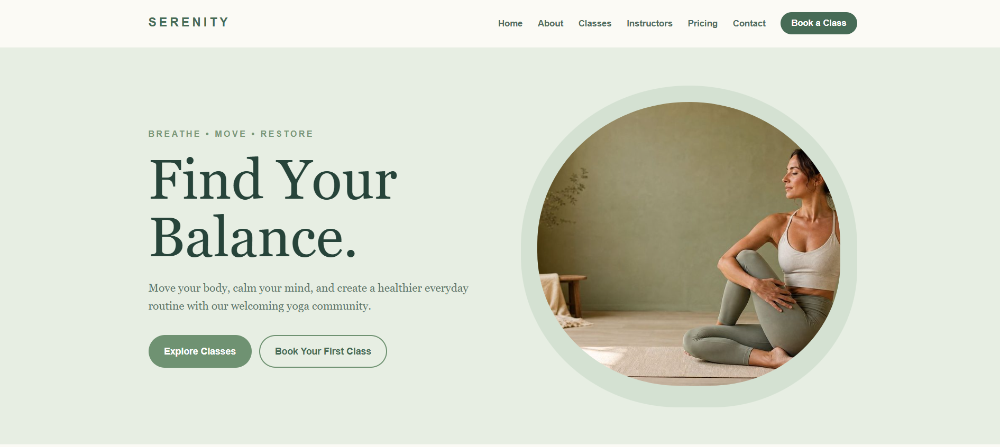

# Yoga Studio Website

## Overview

Serenity Yoga Studio is a single-page business website for a fictional yoga studio.

## Purpose

Helps new students find a suitable class, understand pricing and get in touch to book.

## Features

- Hero section with calls to action (Explore Classes, Book Your First Class)
- Benefits section (Move Better, Feel Stronger, Reduce Stress, Find Your Community)
- Class types (Hatha, Vinyasa Flow, Gentle, Power, Restorative, Morning Yoga) and a weekly schedule
- Instructor profiles and community testimonials
- Three membership tiers: Single Class $18, Monthly $59, Unlimited $89
- Contact/booking form with name, email, class selector and message
- Smooth-scrolling anchor navigation

## Technologies

HTML, CSS. No frameworks or build step; the project is one self-contained `index.html`.

## Responsive Design

Layout adapts with CSS media queries. Tested without horizontal scrolling at 360, 390, 768, 1024 and 1440px widths.

## UI/UX

Soft green palette, serif headings with sans-serif UI text, a circular hero image and plenty of whitespace to suit the calm brand.

## Known Limitations

The contact form is front-end only (`action="#"`): it does not send messages. Studio name, email and phone are placeholders.

## Project Structure

```text
01-yoga-studio-website/
├── index.html
├── screenshots/
└── README.md
```

## Screenshots

|  


## Live Demo

[Live Demo](https://d-sandeepani.github.io/frontend-web-projects/yoga-studio-website/)

## Learning Outcomes

Section-based page layout, CSS Grid/Flexbox, accessible form markup, building a consistent colour system.
